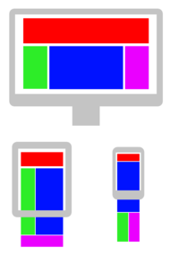

# Sass Responsive Page Layout

## Link

- Live Site URL: [https://saadmalik200.github.io/sass-reponsive-page-layout/](https://saadmalik200.github.io/sass-reponsive-page-layout/)

## Challenge

Create the webpage shown below in the reference image.

## The Overall Layout

## Keep in mind

- Notice the layout differences in the Mobile, Tablet and Desktop version
- Try and make your webpage as close to the reference as possible.
